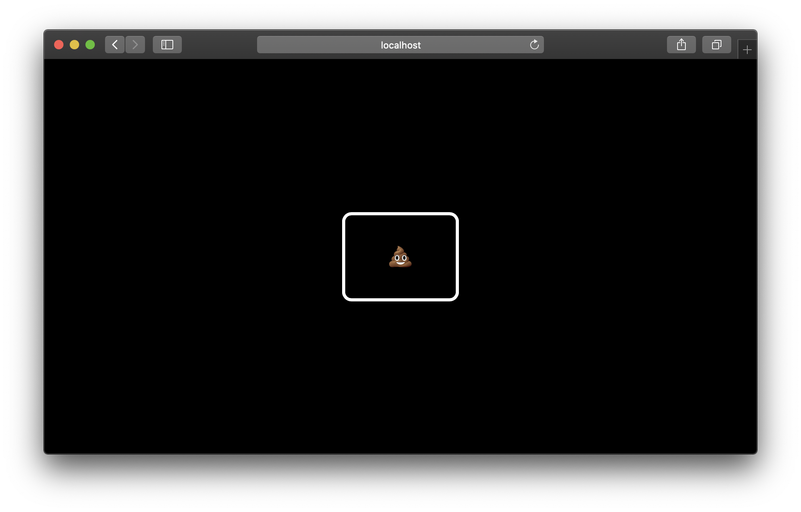

# 💩 keysterr 💩



## Table of Contents

+ [About](#about)
+ [Getting Started](#getting_started)

## About <a name = "about"></a>
Yet another personal experiment with [TypeScript](https://www.typescriptlang.org/), [Next.js](https://nextjs.org/), and [react-spring](https://www.react-spring.io/).

## Getting Started <a name = "getting_started"></a>
These instructions will get you a copy of the project up and running on your local machine for development and testing purposes.

### Installing

```bash
# Clone the repo
git clone https://github.com/AlexMubarakshin/keysterr_demo.git

cd ./keysterr_demo

# Install packages
yarn
```

Run developer build

```bash
yarn dev

# Visit localhost:3000
```

Or run production build

```bash
# Build the project
yarn build

# Run production build
yarn start

# Visit localhost:3000
```
